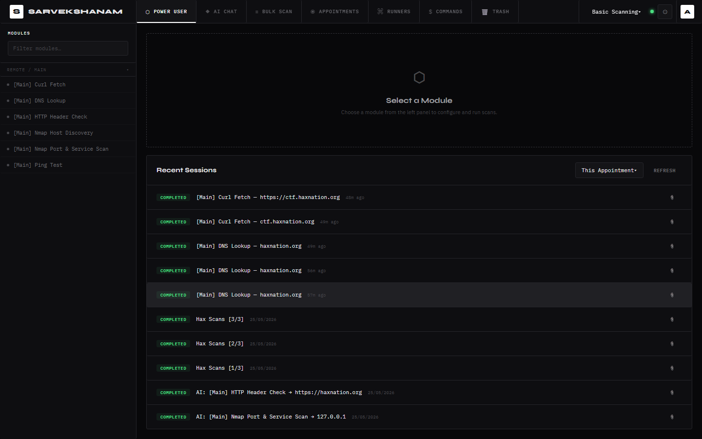
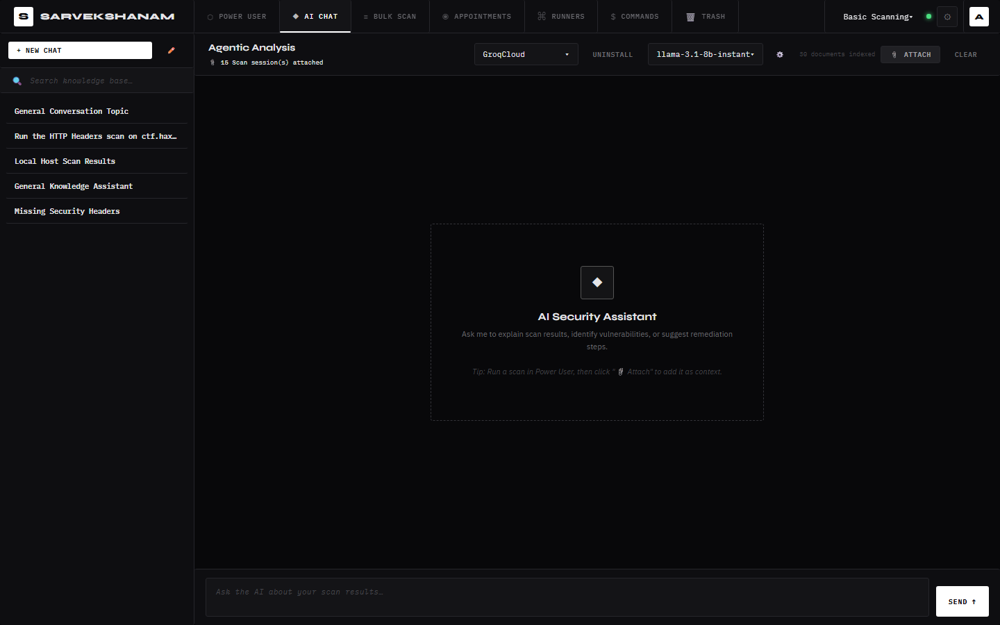

<div align="center">
  <h1>Sarvekshanam</h1>

  <p><b>Advanced Multi-System Security Operations & AI Analysis Platform</b></p>

  <p>
    <a href="https://github.com/yourusername/sarvekshanam/actions"></a>
    <a href="https://nodejs.org/"></a>
    <a href="https://go.dev/"></a>
    <a href="https://opensource.org/licenses/GPL-3.0"></a>
  </p>
</div>

<br/>

**Sarvekshanam (v2 Beta)** is a distributed vulnerability orchestration and AI-assisted security operations platform built around a centralized Node.js Master and scalable Go-based Remote Runners.

Instead of acting as a single monolithic scanner, Sarvekshanam coordinates an entire fleet of execution nodes capable of running custom offensive security modules, collecting telemetry, streaming results in real time, and feeding findings into an agentic AI workflow powered by Retrieval-Augmented Generation (RAG).

---


# 🧠 Architecture

<div align="center">
  
</div>

<br/>

The architecture is designed around four tightly integrated layers:

- **🖥️ Control Layer (Master Server)** — Handles orchestration, authentication, module scheduling, fleet management, report aggregation, and AI coordination.
- **⚙️ Execution Layer (Remote Runners)** — Lightweight Go agents that securely execute tasks inside ephemeral sandboxes across distributed infrastructure.
- **🧠 Intelligence Layer (AI + RAG)** — Processes massive scan outputs, enables contextual AI conversations, summarizes findings, and assists in remediation workflows.
- **📡 Module Ecosystem** — Supports dynamically hot-loaded Python, Bash, Node.js, and Go security modules without requiring recompilation.

This allows Sarvekshanam to function both as a traditional vulnerability orchestration platform and as an intelligent security operations environment capable of scaling from local testing labs to distributed enterprise fleets.

> **Note:** This is Version 2 (currently in Beta) of the original [Sarvekshanam project](https://github.com/A-Y-U-S-H-Y-A/sarvekshanam). V2 introduces distributed Go Slaves, RAG-based intelligence, and an Agentic AI assistant while preserving the orchestration-first philosophy of the original platform.

---

# ✨ Features

- **🚀 Fleet Orchestration**  
  Manage distributed Go Slaves capable of executing arbitrary security scripts and workflows.

- **🤖 Agentic AI Operations**  
  Chat with scan results, generate summaries, correlate findings, and launch additional modules directly from the AI interface.

- **🛡️ Ephemeral Execution Sandboxes**  
  Every task executes inside isolated temporary environments to prevent cross-contamination between scans.

- **📦 Multi-Language Module Support**  
  Dynamically hot-load Python, Bash, Go, or Node.js modules simply by dropping them into the modules directory.

- **🔒 Enterprise-Grade Security**  
  RSA-OAEP encrypted payloads, JWKS authentication, JWT validation, and OIDC SSO integration.

- **🚄 Distributed Bulk Operations**  
  Execute security tooling across hundreds of targets simultaneously through remote execution nodes.

- **📚 AI-Powered Context Retention**  
  Massive outputs are indexed into vector memory using sqlite-vec for intelligent retrieval and contextual conversations.

---

# 📸 Screenshots

| Power User Dashboard | AI Chat Interface |
| :---: | :---: |
|  |  |

---

# 📚 Documentation

The full documentation is available in the [`docs/`](docs/) directory and can be hosted via GitHub Pages.

| Guide | Description |
|---|---|
| [Architecture Overview](docs/architecture.md) | Internal system design and data flow |
| [Getting Started](docs/getting-started.md) | Installation and initial setup |
| [Configuration Guide](docs/configuration.md) | Environment variables and runtime configuration |
| [Module Development Guide](docs/modules-guide.md) | Building custom security modules |
| [Security & Fleet Management](docs/security.md) | Authentication, encryption, and remote node management |
| [AI & Context Integration](docs/ai-integration.md) | RAG pipeline and AI orchestration |

---

# ⚡ Quick Start

## 1. Requirements

- Node.js (v18+)
- Go (v1.25.5+) *(optional for running local remote runners)*

---

## 2. Setup the Master Server

```bash
# Clone the repository
git clone https://github.com/A-Y-U-S-H-Y-A/sarveskshanam_v2.git

# Enter backend directory
cd sarveskshanam_v2/backend

# Install dependencies
npm install

# Configure environment
cp .env.example .env

# Initialize the database
npx sequelize-cli db:migrate
node -e "require('./src/db/database').getDb().sequelize.sync({ alter: true })"
````

Edit `.env` and configure:

* LLM API keys
* JWT secrets
* OIDC settings *(optional)*
* Fleet authentication configuration

---

## 3. Start the Platform

```bash
npm run start
```

The platform will now be available at:

```txt
http://localhost:3000
```

---

## 4. Post-Installation: Create an Admin

To manage remote runners, you need an administrative account.

1. Open `http://localhost:3000` in your browser.
2. Register a new user account (e.g., `alice`).
3. In your terminal, inside the `backend` directory, promote the account:

```bash
node scripts/makeAdmin.js alice
```

---

## 5. Configure Remote Runners (Optional)

Sarvekshanam is built to support distributed execution through lightweight remote runners.

The included Go-based runner can be deployed across VPS instances, internal infrastructure, or isolated lab systems to create a scalable security execution fleet.

See the [Remote Runner README](remote-runner/README.md) for setup instructions.

---

# 🧩 Tech Stack

| Layer                | Technology                                         |
| -------------------- | -------------------------------------------------- |
| **Frontend**         | Vanilla JS, Pure HTML/CSS, Monospace Minimal UI    |
| **Backend**          | Node.js, Express, Sequelize ORM                    |
| **Database**         | SQLite, sqlite-vec                                 |
| **Authentication**   | Passport.js, JWKS, RSA Cryptography                |
| **AI Stack**         | LangChain, Ollama, OpenAI, Anthropic, Gemini, Groq |
| **Remote Execution** | Go 1.25, SSE Streaming                             |
| **Vector Memory**    | Retrieval-Augmented Generation (RAG)               |

---

# 📜 License

This project is licensed under the **GNU General Public License v3.0 (GPLv3)**.

See the [LICENSE](LICENSE) file for more details.

