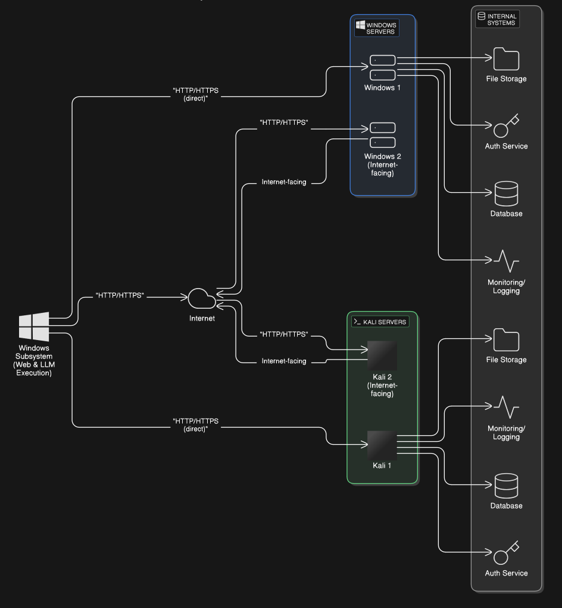

# Architecture Overview

Sarvekshanam uses a distributed architecture designed for scalability, security, and real-time orchestration.

## Core Components

### 1. Master Node (Node.js)
The brain of the operation. It serves the frontend, handles authentication, maintains the database, and orchestrates the distributed slaves.
- **Frontend SPA**: Vanilla JavaScript, single-page application communicating via REST APIs and WebSockets.
- **Execution Queue**: Per-user round-robin queue ensuring fair scheduling when runners hit their concurrency limits.
- **AI Agent**: LangChain-powered integration with multiple LLM providers (Ollama, Anthropic, Gemini, OpenAI).

### 2. Remote Runners / Slaves (Go)
Lightweight execution agents deployed on target networks or edge nodes.
- **Ephemeral Sandboxes**: Every task runs in an isolated temporary directory to prevent cross-contamination.
- **Hot-reloading**: Slaves watch their local `modules/` directory and auto-discover new tools without restarting.
- **SSE Streaming**: Output (stdout/stderr) is streamed back to the Master in real-time via Server-Sent Events.

### 3. Databases
- **Relational DB (SQLite/Sequelize)**: Stores users, sessions, appointments, and runner metadata. Can be swapped to Postgres/MySQL.
- **Vector DB (sqlite-vec / ChromaDB)**: Stores chunked scan outputs as embeddings for the RAG (Retrieval-Augmented Generation) pipeline used by the AI.

## The "Appointment" Entity
The core operational unit in Sarvekshanam is the **Appointment**. 
An appointment groups multiple scan sessions and AI chat histories together. When you ask the AI to "analyze my scans", it automatically has context of all scans executed within the active appointment.

## Master ↔ Slave Data Flow

1. **Discovery**: Master polls registered Runners.
2. **Auth**: Master signs a short-lived JWT using its RSA private key. Runner verifies using Master's public JWKS.
3. **Execution**: Master POSTs to Runner's `/run` endpoint. Sensitive arguments are encrypted using the Runner's public RSA key.
4. **Streaming**: Runner spawns the task, streams output back to Master via SSE.
5. **Storage**: Master broadcasts updates to the UI via WebSocket, and stores the final result in the database and Vector DB.
